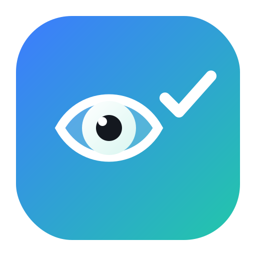
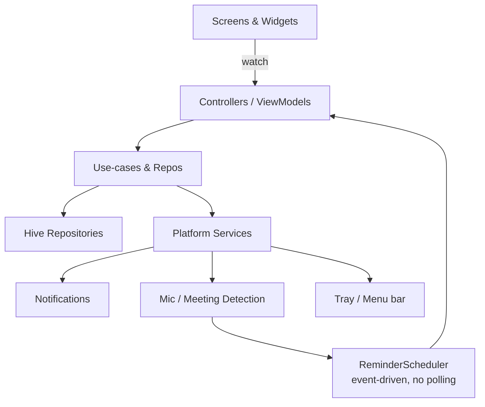

<div align="center">



# 👀 TKK EyeGuard

### Healthy eyes, every hour — without interrupting your meetings.

A lightweight, cross-platform desktop & mobile app that gently reminds you to
rest your eyes every hour, intelligently pausing while you're on a call.

<br/>

[](https://flutter.dev)
[](https://dart.dev)
[](https://m3.material.io)

[](#-downloads)
[](#-downloads)
[](#-downloads)
[](#-downloads)

[](.github/workflows/ci.yml)
[](LICENSE)
[](CONTRIBUTING.md)


</div>

---

## ✨ Why EyeGuard?

Staring at screens all day strains your eyes. The **20-20-20 rule** says: every
20 minutes, look at something 20 feet away for 20 seconds. EyeGuard automates the
healthy habit — and unlike other reminder apps, it **knows when you're in a
meeting** and stays quiet until you're free.

| | |
|---|---|
| 🪶 **Featherweight** | Event-driven, **<30 MB RAM**, near-zero idle CPU. No polling. |
| 🤫 **Meeting-aware** | Detects active microphone use and defers reminders. |
| 🎨 **Beautiful** | Material 3, glassmorphism, custom-painted eye animations. |
| 🔒 **Private** | 100% offline. Your data never leaves your device. |
| 🖥️ **Everywhere** | Windows, macOS, Android & iOS from one codebase. |

---

## 🎯 Features

- **Hourly reminders** with a configurable interval (30 / 45 / 60 / 90 / 120 min).
- **Smart meeting detection** — no popups while your mic is active (Teams, Zoom,
  Meet, Slack, Discord, FaceTime, Webex, Skype, …); resurfaces after a 2–5 min
  cool-down.
- **Native notifications** with **Done · Snooze 5 min · Skip**, respecting Focus
  & Do-Not-Disturb.
- **Guided 30-second routine** — look away, blink, roll clockwise &
  anti-clockwise, breathe — with animated eye, countdown ring and a completion
  celebration.
- **Dashboard** — today's reminders, completed / skipped / snoozed, completion %,
  current streak, weekly & monthly trends, last reminder.
- **Settings** — interval, start-at-login, sound, theme (system / light / dark),
  reset & export.
- **Background presence** — system tray (Windows) / menu bar (macOS); starts at
  login.

---

## 🧱 Architecture

Clean Architecture · MVVM · Riverpod (DI) · Repository pattern · Hive
(offline storage). See [`docs/ARCHITECTURE.md`](docs/ARCHITECTURE.md).



### 📁 Folder structure

```
lib/
├─ main.dart              # Bootstrap (Hive, DI, services)
├─ app/                   # App shell, router, theme, DI, coordinator
├─ core/                  # Config, services, errors, utils
└─ features/
   ├─ reminder/           # Scheduler + history
   ├─ dashboard/          # Statistics
   ├─ settings/           # Preferences
   └─ exercise/           # Guided animated routine
assets/        docs/        installers/        test/        .github/
```

---

## 🚀 Getting started

> The shared Dart codebase lives here. Native runners are generated with one
> command — see [`docs/BUILD.md`](docs/BUILD.md).

```bash
# 1. Generate native platform folders
flutter create --platforms=android,ios,macos,windows,linux .

# 2. Install dependencies
flutter pub get

# 3. Run
flutter run -d macos        # or windows / <android> / <ios>
```

Then add the native microphone-detection handlers from
[`docs/NATIVE_INTEGRATION.md`](docs/NATIVE_INTEGRATION.md).

---

## 📥 Downloads

Pre-built artifacts are produced by GitHub Actions:

- **On every release tag** → attached to the [GitHub Release](../../releases).
- **On demand** → open the **Actions ▸ [Build Artifacts](../../actions/workflows/build-artifacts.yml)**
  workflow, click **Run workflow**, then download from the run's *Artifacts*.

| Platform | Artifact |
|----------|----------|
| 🪟 Windows | Portable build (`.zip`) + Inno Setup installer (`.exe`) |
| 🍎 macOS | `.dmg` (drag-to-Applications) |
| 🤖 Android | `.apk` + `.aab` |
| 📱 iOS | Unsigned `.ipa` (re-sign with your Apple cert — see [`docs/RELEASE.md`](docs/RELEASE.md)) |

---

## 🛠️ Tech Stack

| Layer | Choice |
|-------|--------|
| UI | Flutter, Material 3 |
| State / DI | Riverpod |
| Routing | go_router |
| Storage | Hive (offline) |
| Notifications | flutter_local_notifications |
| Desktop | window_manager · tray_manager · launch_at_startup |
| Architecture | Clean Architecture + MVVM + Repository pattern |

---

## ⚡ Performance

Designed from the ground up to be invisible on your system:

- **Event-driven**, single-timer scheduler — **no polling loops**.
- Procedurally-painted animations (no heavy Lottie/GIF assets).
- Target **<20–30 MB RAM**, negligible CPU & battery, small disk footprint.
- Fully **offline** — zero network calls.

---

## ✅ Quality & CI/CD

- `flutter analyze` (strict lints) · `dart format` check · unit, widget &
  integration tests on every push.
- Multi-platform build matrix (Android / macOS / Windows / iOS).
- **CodeQL** security scanning + **Dependabot** updates.
- Tag-driven **automated releases** with artifacts attached. See
  [`docs/RELEASE.md`](docs/RELEASE.md).

---

## 🗺️ Roadmap

Architecture already supports these future additions:

- [ ] AI posture & face-distance detection (webcam fatigue)
- [ ] Water / stretch reminders · Pomodoro & break timer
- [ ] Health analytics (Apple Health · Google Fit · wearables)
- [ ] Optional encrypted cloud sync & multi-device

---

## 🤝 Contributing

Contributions are welcome! Read [`CONTRIBUTING.md`](CONTRIBUTING.md) and our
[Code of Conduct](CODE_OF_CONDUCT.md). Run `dart format . && flutter analyze &&
flutter test` before opening a PR.

---

## 📜 License

Released under the [MIT License](LICENSE).

---

## 🙏 Acknowledgements

Built with the wonderful Flutter ecosystem — Riverpod, Hive, go_router,
flutter_local_notifications, window_manager & tray_manager.

---

<div align="center">

### 🔗 Connect with Techie Krishna Kayaking

<a href="https://www.linkedin.com/in/krishnakayaking/"></a>&nbsp;
<a href="https://www.youtube.com/@TechieKrishnaKayaking"></a>&nbsp;
<a href="https://www.techiekrishnakayaking.com/"></a>&nbsp;
<a href="https://topmate.io/techie_krishna_kayaking"></a>&nbsp;
<a href="https://www.instagram.com/techiekrishnakayaking/"></a>&nbsp;
<a href="https://play.google.com/store/apps/details?id=co.diaz.ycvkc&hl=en_IN"></a>

<br/><br/>

⭐ If EyeGuard helps your eyes, consider starring the repo!

</div>
